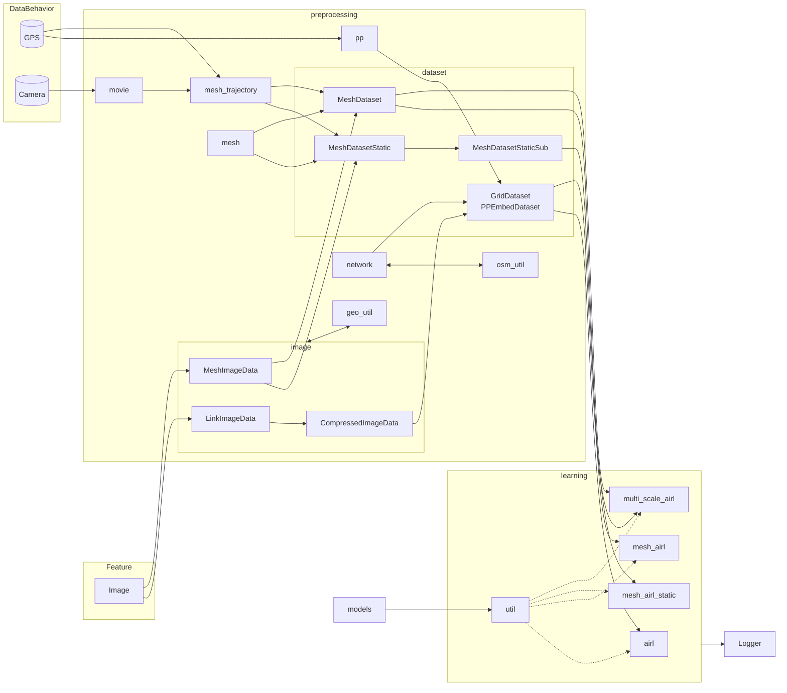

# Route Choice Models with Link Image

## Abstract
Main components
- Preprocessing
- Model
- AIRL route choice model
- Recursive logit model
- Logger

## Requirements
See `requirements.txt`
## Usage
1. Create a new conda environment
```bash
conda create -n new_env --file requirements.txt -c conda-forge -c pytorch
```
2. Activate the environment
```bash
conda activate new_env
```
3. Add the project folder to the python path in your IDE settings
4. Change the paths in the config files to the correct paths on your machine
5. Run the main python files in the `main` folder

## Structure


## References
- Oyama, Y., & Hato, E. (2017). A discounted recursive logit model for dynamic gridlock network analysis. Transportation Research Part C: Emerging Technologies, 85, 509–527.
- Zhao, Z., & Liang, Y. (2023). A deep inverse reinforcement learning approach to route choice modeling with context-dependent rewards. Transportation Research Part C: Emerging Technologies, 149, 104079.
- Alsaleh, R., & Sayed, T. (2021). Markov-game modeling of cyclist-pedestrian interactions in shared spaces: A multi-agent adversarial inverse reinforcement learning approach. Transportation Research Part C: Emerging Technologies, 128, 103191. https://doi.org/10.1016/j.trc.2021.103191
## License
MIT